# 1. useState
## 1.1 set 函数
仅更新下一次渲染的状态变量。如果在调用 set 函数后读取状态变量，则仍然会得到旧的值。如果需要使用下一个状态，可以将其保存在变量中。
### 1.1.1 例子：
`const nextCount = count + 1;//使用这个变量
setCount(nextCount);
console.log(count); // 0
console.log(nextCount); // 1`

## 1.2 setAge(a => a + 1)与setAge( a + 1)区别：
### 1.2.1 结论
setAge(a => a + 1)拿到的是最新的状态，即使在快速连续多次更新时，也不会用到过时的值。适合基于当前状态进行计算时使用。
setAge( a + 1)则是当前渲染时刻的状态值，不会考虑状态是否在同一渲染中已经被更新，适合不依赖最新状态值的场景。
React官方也推荐编写时首选使用更新器，可实现根据之前的状态更新状态，比如setAge(a => a + 1)。

### 1.2.2 为什么
这是因为 setAge(a => a + 1) 使用了 "函数式更新"（functional update），它是 React useState 的一个特性，专门用来确保在异步状态更新时，总能拿到最新的状态值。
如果我们直接用当前 age，可能会因为闭包拿到过期的状态值。这就是React 中的闭包陷阱。
闭包陷阱：在 React 中，函数组件中的状态和变量是“闭包”中的值。
当一个函数（如 handleClick）在组件渲染时被创建，它会捕获当时的状态和变量的快照。
如果状态更新是异步的，这个函数里的状态值可能会滞后于最新状态，导致你用的是过期的状态值。
### 1.2.3 例子
#### 1.2.3.1 setAge(a => a + 1)

`const [age, setAge] = useState(0);
const handleClick = () => {
  setAge(a => a + 1); // 基于最新的 age 更新，确保不会丢失更新
  setAge(a => a + 1); // 第二次更新也基于最新 age
 };
handleClick();
console.log(age); // 结果是 2`

#### 1.2.3.2 setAge( a + 1)
`const [age, setAge] = useState(0);
const handleClick = () => {
  setAge(age + 1); // 基于当前 age = 0 更新
  setAge(age + 1); // 再次基于当前 age = 0 更新
};
handleClick();
console.log(age); // 结果是 1（不是 2！）`
## 1.3 更新状态中的对象和数组
### 1.3.1 例子
#### 1.3.1.1 正确更新状态中的对象例子（解构 + 新属性，或覆盖原属性来创建一个新对象）
`setForm({
...form,
firstName: 'Taylor'
});`
#### 1.3.2.1 正确更新状态中的数组例子（解构 + 新属性，或覆盖原属性来创建一个新数组）
`setTodos([
...todos,
{
id: nextId++,
title: title,
done: false
}
]);`
#### 1.3.3.1 错误例子
`const [form, setForm] = useState({ firstName: 'Alice' });
const handleChange = () => {
  form.firstName = 'Taylor'; // ❌ 直接修改状态对象
  console.log(form.firstName); // Taylor ✅，但是状态实际上没更新！
};`
### 1.3.2 正确写法与错误写法的分析
### 1.3.2.1 分析
React 的状态是不可变的（Immutable）。在 React 中，useState 或 this.state 返回的状态对象是一个快照。你不能直接修改这个对象的属性，否则 React 不会检测到状态变化。
React 判断状态是否变化时，是比较对象引用（Object.is()）。如果直接修改对象属性，对象引用没变，React 以为状态没变，就不会重新渲染。 所以即使改了属性，UI 也不会自动更新。对象的引用会在创建一个新对象或者新数组时发生变化。还会在使用解构、spread（...）、Array.map()、Array.filter() 等方法时变化。
依赖项的比较也是使用Object.is()。使用 useMemo 和 useCallback目的也是为了确保函数和对象引用不变。useMemo 和 useCallback 只有依赖不变时，才保持引用不变。

## 1.4 避免重新创建初始状态
### 1.4.1 例子
#### 1.4.1.1 正确例子（createInitialTodos为函数时）
`const [todos, setTodos] = useState(createInitialTodos);传函数，正确，只会在初始化时调用它`

#### 1.4.1.2 存在问题例子（createInitialTodos为函数时）
`const [todos, setTodos] = useState(createInitialTodos());传值，存在问题，除了初始渲染，仍会在每次渲染时调用此函数，进行不必要的计算，尤其是初始化逻辑可能比较复杂或昂贵的情况影响比较大。`

### 1.4.2 分析
为什么会这样？

useState 接收的参数如果是一个直接值，在每次渲染中都会被求值。虽然 React 会缓存状态值，但如果是一个常量，它每次都会重新传递给 useState。 所以每次渲染时，createInitialTodos() 都会执行，无论状态是否真的需要初始化。 只有第一次渲染时，useState 才会用这个值初始化状态，之后它会忽略这个参数。但这个函数仍然会在每次渲染时执行。useState 的接收的参数如果是一个函数会惰性求值，只会在第一次渲染时调用这个函数来初始化状态。后续渲染时，React 不会重新执行 someFunction，而是直接使用计算好的 fn状态值。
## 1.5 可使用key来重置状态
在 React 中，key 是一个特殊的属性，主要用于帮助 React 高效地识别哪些组件发生了变化、添加或移除。但它还有一个特别实用的功能：重置组件的内部状态。常用于需要重置组件状态的场景，比如表单（表单重置）、动画（动画重置）等。 
### 1.5.1 为什么
React 按 key 区分组件实例： 当 key 改变时，React 不会复用现有组件，而是销毁旧组件，重新创建一个新的组件实例。
组件被重新创建，状态也会重置： 新组件会从头执行初始化逻辑，包括 useState、useReducer、useRef 等钩子。
### 1.5.2 例子
`const [userId, setUserId] = useState(1);
function switchUser() {
  setUserId(userId === 1 ? 2 : 1);
}
function UserForm({ userId }) {
  const [name, setName] = useState('');
  return (
    

      <input
        value={name}
        onChange={e => setName(e.target.value)}
      />
      <button onClick={switchUser}>切换用户</button>
    

  );
}
`
## 1.6 什么时候用 useRef？
✅ 需要存储数据，但不希望触发组件重新渲染
✅ 需要访问 DOM（如 input.focus()）
✅ 需要存储 上一次的 state 值
✅ 需要持久化数据，而不是在每次渲染时重置

## 1.7 什么时候用 useState？
✅需要触发 UI 更新时。
✅状态变化需要反映在界面上。
✅需要参与 React 生命周期和闭包。

# 2.useEffect
## 2.1 useEffect(setup, dependencies?) 
setup：具有副作用逻辑的函数，也可以选择返回一个清理函数。当组件被添加到 DOM 时(componentDidMount)，React 将运行设置函数，在组件从 DOM 中移除后(componentWillUnmount)，React 将运行你的清理函数。在每次使用更改的依赖重新渲染后，React 将首先使用旧值运行清理函数（如果有提供的话），然后使用新值运行设置函数。useEffect相当于componentDidMount，componentDidUpdate 和 componentWillUnmount 这三个生命周期函数的组合。
## 2.2 何时使用
如果不尝试与某些外部系统（网络、某些浏览器 API 或第三方库，这些系统不受 React 控制，因此它们被称为外部系统。）同步，可能不需要副作用。
## 2.3 useEffect 与 useLayoutEffect
如果正在执行一些视觉操作（例如，定位工具提示），并且延迟很明显（例如，它闪烁），请将 useEffect 替换为 useLayoutEffect。
## 2.4 useEffect 在客户端与服务器
### 2.4.1 结论
副作用仅在客户端上运行。它们不会在服务器渲染期间运行。比如在Next.js这种支持 SSR 的框架中。
### 2.4.2 实践
#### 2.4.2.1 注意事项
useEffect 可实现在服务器和客户端显示不同的内容，因为useEffect 只会在客户端执行但是请谨慎使用此模式。避免出现水合不一致，页面闪烁， SEO 问题等。
#### 2.4.2.2 水合（Hydration）
在像 Next.js、Nuxt.js 这样的 SSR（服务器端渲染）框架中，页面的渲染分为两个阶段：
SSR 阶段（服务器端渲染）：服务器生成 HTML，把页面的静态内容发给浏览器。
Hydration 阶段（客户端激活）：客户端用 React 或 Vue 接管这份 HTML，把它变成一个可交互的 SPA。
水合的目标是让客户端 React 组件状态与服务器端生成的 HTML 完全一致，从而顺利“激活”页面。

#### 2.4.2.3 水合不一致（Hydration Mismatch），页面闪烁， SEO 问题
水合不一致就是：服务器端渲染的 HTML 和客户端渲染的内容不一致。React 在水合时检测到这种情况，会报错。

水合不一致会导致页面闪烁。

搜索引擎爬虫一般只解析服务器端 HTML，不会执行客户端 JS。
如果用 useEffect 控制客户端独占内容，这些内容不会在服务器 HTML 中出现，导致搜索引擎完全看不到这些内容。

#### 2.4.2.4 例子
`import { useEffect, useState } from "react";
function ServerClientContent() {
  const [isClient, setIsClient] = useState(false);
  useEffect(() => {
    setIsClient(true); // 只会在客户端执行
  }, []);
  return (
    

      {isClient ? (
        
这是客户端渲染的内容 🌐

      ) : (
        
这是服务器渲染的内容 🖥️

      )}
    

  );
}
export default ServerClientContent;`

#### 2.4.2.5 其他方法
在许多情况下，可以通过使用 CSS 有条件地显示不同的内容来实现
#### 2.4.2.5.1 @media
1.用@media 查询来隐藏服务器端的内容，仅客户端生效，大多数情况通用。
✅ 优点：性能好，不需要 JS 操作，避免 hydration 问题。
适用场景：响应式布局、设备差异展示。
例子:
`@media (min-width: 768px) {
  .client-only {
    display: none;
  }
}`

#### 2.4.2.5.2 prefers-reduced-motion

2.使用 prefers-reduced-motion，服务器不会解析 prefers-reduced-motion，可用于仅客户端显示内容时。
✅ 优点：结合用户系统偏好，适合动画、特效控制。
❌ 缺点：受限于浏览器和系统设置支持，不是通用方案。
适用场景：动画、交互效果控制。
例子:
`@media (prefers-reduced-motion: reduce) {
  .animated-content {
    display: none;
  }
}`

#### 2.4.2.5.3 visibility: hidden + JavaScript 反转
使用 visibility: hidden + JavaScript 反转，通过 visibility: hidden 在服务器端隐藏客户端内容，等到客户端渲染后通过 JavaScript 让其可见。SEO 友好。
✅ 优点：服务器端保留元素结构，SEO 友好。
❌ 缺点：客户端需要 JS 反转，稍微增加渲染复杂度。
适用场景：需要服务器端预渲染但在客户端控制显示。

例子：
`.client-only {
  visibility: hidden;
}
useEffect(() => {
  document.querySelector(".client-only").style.visibility = "visible";
}, []);`
#### 2.4.2.5.4 display: none + JavaScript 显示
使用 display: none + JavaScript 显示，适用场景：需要减少闪烁，但不希望服务器渲染该内容，防止页面跳动。
✅ 优点：防止页面跳动，减少客户端首次渲染时的视觉不一致。
❌ 缺点：SEO 不友好，服务器端完全不展示。
适用场景：页面加载后才展示的交互组件、弹窗、动态内容。
例子：
`.client-only {
  display: none;
}
useEffect(() => {
  document.querySelector(".client-only").style.display = "block";
}, []);`
## 2.5 控制非 React 小部件
控制非 React 小部件,通过使用 useRef 来存储非 React 组件的实例，通过useEffect实现首次渲染时 创建非 React 组件的实例并绑定到 ref，在依赖项变化时使用useState的set 函数保持状态同步。
例子：
`import { useState } from 'react';
import Map from './Map.js';
export default function App() {
  const [zoomLevel, setZoomLevel] = useState(0);
  return (
    <>
      Zoom level: {zoomLevel}x
      <button onClick={() => setZoomLevel(zoomLevel + 1)}>+</button>
      <button onClick={() => setZoomLevel(zoomLevel - 1)}>-</button>
      

      <Map zoomLevel={zoomLevel} />
    </>
  );
}
`

`import { useRef, useEffect } from 'react';
import { MapWidget } from './map-widget.js';
export default function Map({ zoomLevel }) {
  const containerRef = useRef(null);
  const mapRef = useRef(null);
  useEffect(() => {
    if (mapRef.current === null) {
      mapRef.current = new MapWidget(containerRef.current);
    }
    const map = mapRef.current;
    map.setZoom(zoomLevel);
  }, [zoomLevel]);
  return (
    

  );
}`

`import 'leaflet/dist/leaflet.css';
import * as L from 'leaflet';
export class MapWidget {
  constructor(domNode) {
    this.map = L.map(domNode, {
      zoomControl: false,
      doubleClickZoom: false,
      boxZoom: false,
      keyboard: false,
      scrollWheelZoom: false,
      zoomAnimation: false,
      touchZoom: false,
      zoomSnap: 0.1
    });
    L.tileLayer('https://tile.openstreetmap.org/{z}/{x}/{y}.png', {
      maxZoom: 19,
      attribution: '© OpenStreetMap'
    }).addTo(this.map);
    this.map.setView([0, 0], 0);
  }
  setZoom(level) {
    this.map.setZoom(level);
  }
}`
## 2.6 “竞态条件” 的影响
通过useEffect 可以确保你的代码不会受到 “竞态条件” 的影响： 网络响应可能以与你发送它们不同的顺序到达。
例子：

`useEffect(() => {
let ignore = false;
setBio(null);
fetchBio(person).then(result => {
if (!ignore) {
setBio(result);
}
});
return () => {
ignore = true;
};
}, [person]);`
## 2.7 在副作用中创建对象
避免使用在渲染期间创建的对象作为依赖。而是，在副作用中创建对象，可避免运行得太频繁。
正确例子：
`import { useState, useEffect } from 'react';
import { createConnection } from './chat.js';
const serverUrl = 'https://localhost:1234';
function ChatRoom({ roomId }) {
  const [message, setMessage] = useState('');
  useEffect(() => {
    const options = {
      serverUrl: serverUrl,
      roomId: roomId
    };
    const connection = createConnection(options);
    connection.connect();
    return () => connection.disconnect();
  }, [roomId]);
  return (
    <>
      <h1>Welcome to the {roomId} room!</h1>
​      <input value={message} onChange={e => setMessage(e.target.value)} />
​    </>
  );
};
export default function App() {
  const [roomId, setRoomId] = useState('general');
  return (
​    <>
​      <label>
​        Choose the chat room:{' '}
        <select
          value={roomId}
          onChange={e => setRoomId(e.target.value)}
        >
          <option value="general">general</option>
          <option value="travel">travel</option>
          <option value="music">music</option>
        </select>
​      </label>
      

​      <ChatRoom roomId={roomId} />
​    </>
  );
}
`

存在问题例子：
`const serverUrl = 'https://localhost:1234';
function ChatRoom({ roomId }) {
const [message, setMessage] = useState('');
const options = { // 🚩 This object is created from scratch on every re-render
serverUrl: serverUrl,
roomId: roomId
};
useEffect(() => {
const connection = createConnection(options); // It's used inside the Effect
connection.connect();
return () => connection.disconnect();
}, [options]); // 🚩 As a result, these dependencies are always different on a re-render
// ...`
# 3.Source Map
## 3.1 什么是Source Map
通俗的来说， Source Map 就是一个信息文件，里面存储了代码打包转换后的位置信息，实质是一个 json 描述文件，维护了打包前后的代码映射关系。
## 3.2 webpack
### 3.2.1 webpack.config.js
`devtool: 'source-map',`
### 3.2.2 Webpack 中的 Source Map
source-map：外部。可以查看错误代码准确信息和源代码的错误位置。
inline-source-map：内联。只生成一个内联 Source Map，可以查看错误代码准确信息和源代码的错误位置
hidden-source-map：外部。可以查看错误代码准确信息，但不能追踪源代码错误，只能提示到构建后代码的错误位置。
eval-source-map：内联。每一个文件都生成对应的 Source Map，都在 eval 中，可以查看错误代码准确信息 和 源代码的错误位置。
nosources-source-map：外部。可以查看错误代码错误原因，但不能查看错误代码准确信息，并且没有任何源代码信息。
cheap-source-map：外部。可以查看错误代码准确信息和源代码的错误位置，只能把错误精确到整行，忽略列。
cheap-module-source-map：外部。可以错误代码准确信息和源代码的错误位置，module 会加入 loader 的 Source Map。

#### 3.2.2.1 内联和外部的区别：

外部生成了文件（.map），内联没有。
内联构建速度更快。

#### 3.2.2.2  7 种类型具体的案例演示：
#### 3.2.2.2.1  演示代码：
`console.log('source map!!!')
var a = 1;
console.log(a, b); //这一行肯定会报错`

#### 3.2.2.2.2  source-map：
`devtool: 'source-map'
`
编译后，可以查看错误代码准确信息和源代码的错误位置：

生成了 .map 文件：

#### 3.2.2.2.3  inline-source-map：
`devtool: 'inline-source-map'
`
编译后，可以查看错误代码准确信息和源代码的错误位置：

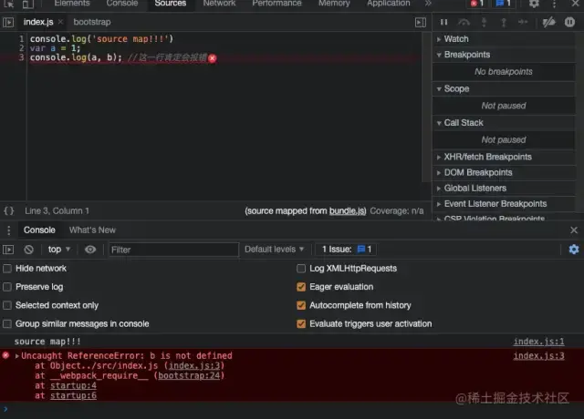

但是没有生成 .map文件 ，而是以 base64 的形式插入到 sourceMappingURL 中：

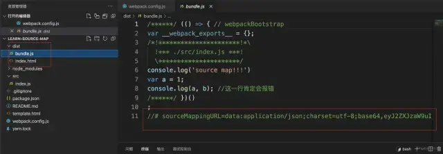

#### 3.2.2.2.4  hidden-source-map：
`devtool: 'hidden-source-map'
`
编译后，可以查看错误代码准确信息，但是无法查看源代码的位置：

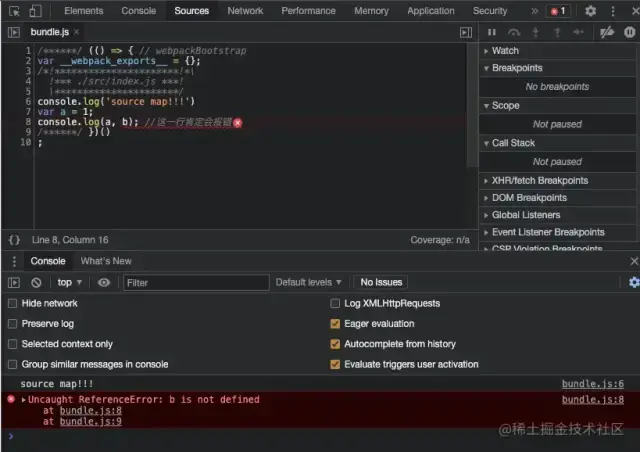

生成了 .map 文件：

#### 3.2.2.2.5  eval-source-map：
`devtool: 'eval-source-map'
`
编译后，可以查看错误代码准确信息和源代码的错误位置：
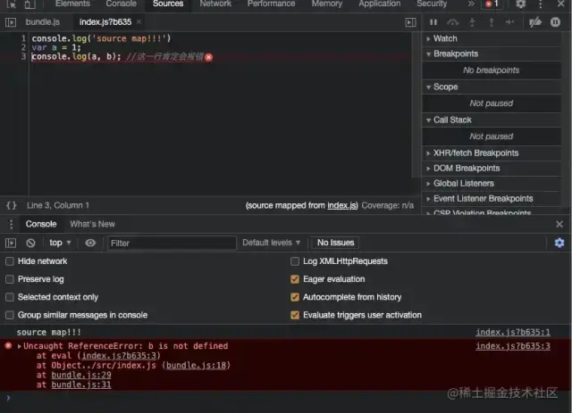
但是没有生成 .map文件 ，而是在 eval函数 中，包括 sourceMappingURL :
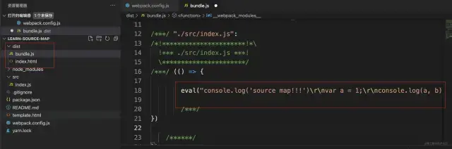
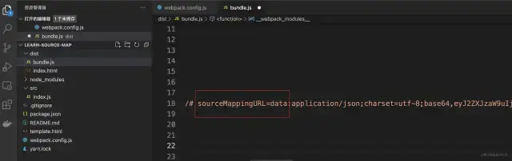

#### 3.2.2.2.6  nosources-source-map：
`devtool: 'nosources-source-map'
`
编译后，可以查看无法查看错误代码的准确位置和源代码的错误位置，只能提示错误原因：

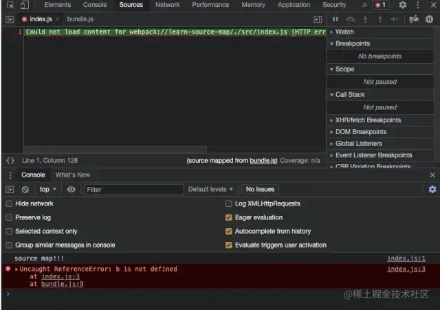
生成了 .map 文件：
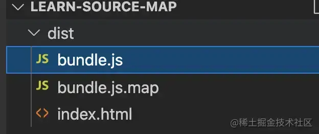

#### 3.2.2.2.7  cheap-source-map：
`devtool: 'cheap-source-map'
`
编译后，可以查看错误代码准确信息和源代码的错误位置，但是忽略了具体的列（ 因为是b导致报错 ）：

生成了 .map 文件：

#### 3.2.2.2.8  cheap-module-source-map：
因为需要 module ，所以案例中增加 loader ：
`module: {
    rules: [{
        test: /\.css$/,
        use: [
            // style-loader：创建style标签，将js中的样式资源插入进去，添加到head中生效
            'style-loader',
            // css-loader：将css文件变成commonjs模块加载到js中，里面内容是样式字符串
            'css-loader'
        ]
    }]
}`

在 src 目录下新建 index.css 文件，添加样式代码：

`body {
    margin: 0;
    padding: 0;
    height: 100%;
    background-color: pink;
}`

然后在 src/index.js 中引入 index.css ：

`//引入index.css
import './index.css';

console.log('source map!!!')
var a = 1;
console.log(a, b); //这一行肯定会报错`

修改 devtool ：
`devtool: 'cheap-module-source-map'
`
打包后，打开浏览器，样式生效，说明 loader 引入成功。可以查看错误代码准确信息和源代码的错误位置，但是忽略了具体的列（ 因为是b导致报错 ）：

生成了 .map 文件，同时，将 loader 的信息也一起打包进来:

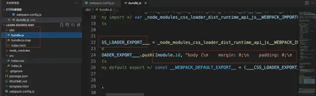
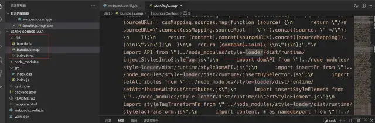

## 3.3 作用
错误追踪：如果代码经过打包、压缩，错误的行号可能不准确，而 SourceMap 可以帮助你准确定位到源代码的错误位置。

调试优化：在浏览器开发者工具中，仍然可以查看和调试未压缩的原始源码，而不是混淆后的代码。

代码可读性：虽然生产环境使用压缩代码提高性能，但 SourceMap 允许开发者在本地调试时仍然能看到格式化的代码。
## 3.4 如何使用 Source Map
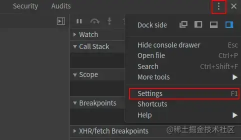
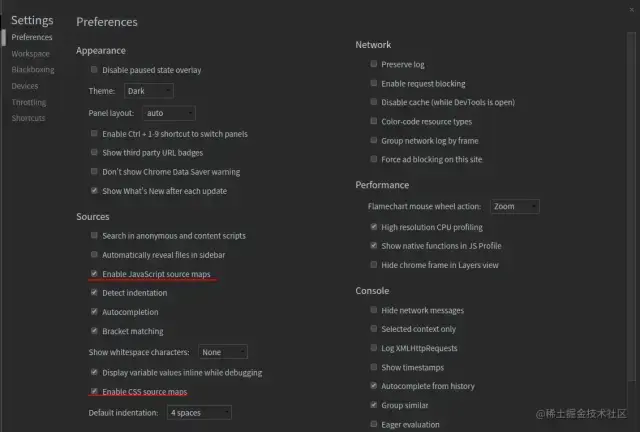
## 3.5 工作原理
### 3.5.1 被编译代码,bundle.js与bundle.js.map文件例子
`console.log('source map!!!')
console.log(a); //这一行肯定会报错`

`/******/
(() => { // webpackBootstrap
    var __webpack_exports__ = {};
    /*!**********************!*\
      !*** ./src/index.js ***!
      \**********************/
    var a = 1;
    console.log(a);
    /******/
})();
//# sourceMappingURL=bundle.js.map`

`{
    "version": 3,
    "sources": [
        "webpack://learn-source-map/./src/index.js"
    ],
    "names": [],
    "mappings": "AAAA;AACA,c",
    "file": "bundle.js",
    "sourcesContent": [
        "var a = 1;\r\nconsole.log(a);"
    ],
    "sourceRoot": ""
}`

### 3.5.2 bundle.js与bundle.js.map例子说明
//# sourceMappingURL=bundle.js.map
正是因为这句注释，标记了该文件的 Source Map 地址，浏览器才可以正确的找到源代码的位置。sourceMappingURL 指向 Source Map 文件的 URL 。
`dist` 文件夹中，除了 `bundle.js` 还有 `bundle.js.map` ，这个文件才是 `Source Map` 文件，也是 `sourceMappingURL` 指向的 `URL`

mappings 属性的值是：AAAA; AACA, c ，
这是一个字符串，它分成三层：

第一层是行对应，以分号（; ）表示，每个分号对应转换后源码的一行。所以，第一个分号前的内容，就对应源码的第一行，以此类推。
第二层是位置对应，以逗号（, ）表示，每个逗号对应转换后源码的一个位置。所以，第一个逗号前的内容，就对应该行源码的第一个位置，以此类推。
第三层是位置转换，以VLQ 编码[16]表示，代表该位置对应的转换前的源码位置。

总结，就是转换后的源码分成两行，第一行有一个位置，第二行有两个位置。

# ?.小知识
## 1.浅拷贝与深拷贝
浅拷贝是创建一个新对象，这个对象有着原始对象属性值的一份精确拷贝。如果属性是基本类型，拷贝的就是基本类型的值，如果属性是引用类型，拷贝的就是内存地址 ，所以如果其中一个对象改变了这个地址，就会影响到另一个对象。
深拷贝是将一个对象从内存中完整的拷贝一份出来,从堆内存中开辟一个新的区域存放新对象,且修改新对象不会影响原对象。

总而言之，浅拷贝只复制指向某个对象的指针，而不复制对象本身，新旧对象还是共享同一块内存。但深拷贝会另外创造一个一模一样的对象，新对象跟原对象不共享内存，修改新对象不会改到原对象。

代码示例：
`const obj1 = { x: { y: 2 } };
const obj2 = { ...obj1 }; // 浅拷贝
console.log(obj1 === obj2);   // false （obj2 是一个新对象）
console.log(obj1.x === obj2.x); // true （它们的 x 属性指向相同的地址）`

tips：新对象与原始对象指向同一个内存地址指的是完全相同的对象

代码示例：
`const obj1 = { x: { y: 2 } };
const obj2 = obj1; // 直接赋值
console.log(obj1 === obj2);   // true （完全相同的对象）
console.log(obj1.x === obj2.x); // true （内部对象也相同）
`
## 2.赋值和深/浅拷贝的区别

