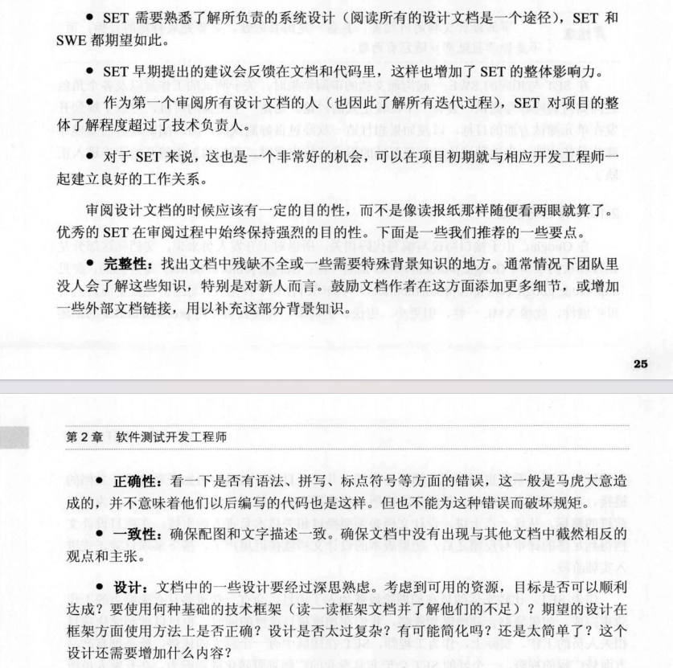
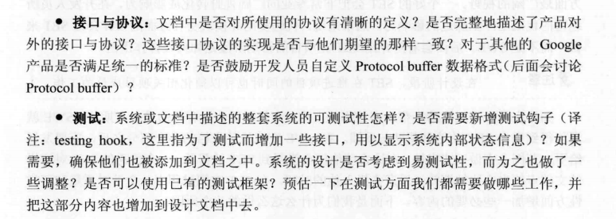
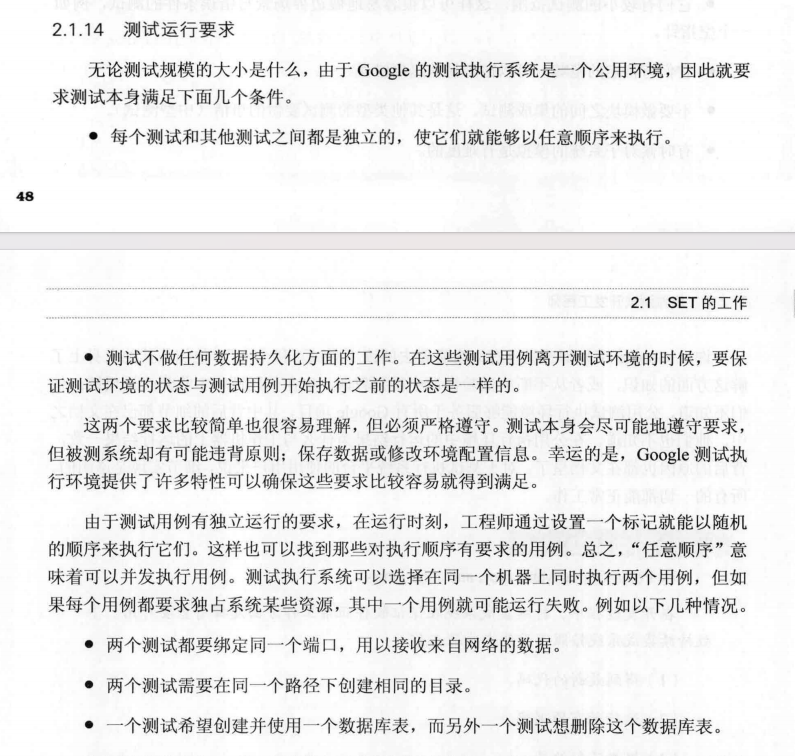
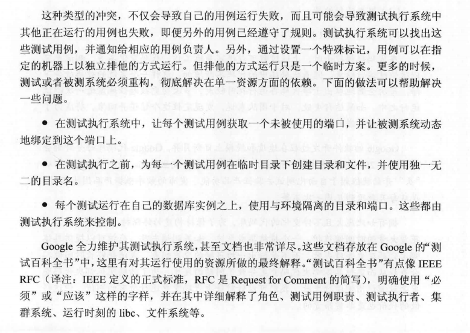

# 1.提高覆盖率
## 1.1 代码覆盖率
覆盖率 = 被测试执行的代码行数 / 总代码行数 × 100%
分支覆盖率：if / switch / 三元表达式等判断逻辑的不同路径是否都执行了
条件覆盖率：每个布尔子表达式都是否为 true/false 被测试过
重点是分支和条件覆盖率，因为它们能更有效评估逻辑是否被完全测试

## 1.2 方案
### 1.2.1 测试覆盖率可视化
具体待调研

### 1.2.2 PR流程优化
PR里增加test case，执行结果报告，覆盖率程度，各种极端情况的文本说明

# 2.哪些做到了
## 2.1 autober工具与优化
目前能让开发或者任何角色一定程度上能容易的编写测试代码且未来可能会更容易编写，对应功能更强大。后续可根据实际内部人员体验反馈进行优化

## 2.2 小型测试

## 2.4 录制功能让部分手动编写测试代码变自动编写测试代码

## 2.5 mock数据

## 2.6 代码审查

# 3.哪些没做到
## 3.1 测试覆盖率可视化工具

## 3.2 中型测试与大型测试覆盖率不足
测试是开发过程不可缺少的一步，目前中型测试与大型测试覆盖率不足

## 3.3 autober优化方向
### 3.3.1 build时间优化
### 3.3.2 如何批量执行大量test case
额外的其他功能，比如执行test case自动记录bug，对应结果发送邮件给对应开发人员

## 3.4 代码审查相关
1.PR前需要先自动化检查，针对格式和是否通过test case，后者目前缺少

## 3.5 提交到版本控制系统后自动运行项目的相关测试

## 3.6 大型测试与批量中型测试还未自动化实现,怎么实现？

# 4.不确定但是可以看看
## 4.1 思维
1.开发前去思考如何测试他即将编写的代码，考虑各种极端情况。
2.测试主要思路是去破坏，怎样写测试代码用以扰乱分离用户及其数据。
3.测试是应用产品的另外一种功能
4.测试是开发过程不可缺少的一步

## 4.2 设计文档需要审阅与对应的要求

## 4.3 测试运行要求

## 4.4 三种不太类型测试比例目标
总体上有一个经验法则，即70/20/10原则:70%是小型测试，20%是中型测试，10%是大型测试。如果
一个项目是面向用户的，拥有较高的集成度，或者用户接口比较复杂，他们就应该有更多
的中型和大型测试:如果是基础平台或者面向数据的项目，例如索引或网络爬虫，则最好
有大量的小型测试，中型测试和大型测试的数量要求会少很多。

# 4.各方角色落地方案
## 4.1 提交者
1.编写测试代码，编写测试代码时，考虑各种极端情况。
2.关注并提高每次提交代码的测试覆盖率
3.PR里增加test case，执行结果报告，覆盖率程度，各种极端情况的文本说明。

## 4.2 reviewer
1.考虑测试代码是否合理，是否覆盖了各种极端情况
2.考虑功能代码，备注等是否存在问题或者有更好的方案

## 4.3 开发测试
1.测试覆盖率可视化工具开发
2.autober工具根据实际内部体验反馈优化
3.大型测试与批量中型测试还未自动化实现
4.代码审查新增是否通过test case功能
5.提交到版本控制系统后自动运行项目的相关测试

# 5. 当前目的与方案
## 5.1 能发现明显或者常规的bug

概念：小型测试一般来说(但也并非所有)都是自动化实现的，用于验证一个单独函数或独
立功能模块的代码是否按照预期工作，着重于典型功能性问题、数据损坏、错误条件和大
小差一错误(译注:大小差一(of-by-one)错误是一类常见的程序设计错误)等方面的验
证。测试代码覆盖率达到XX以上？
Google的SWE就是功能开发人员，负责客户使用的功能模块开发。他们编写功能代
码及这些功能的单元测试代码。
Google的SET就是测试开发人员，部分职责是在单元测试方面给予开发人员支持，另
外一部分职责是为开发人员提供测试框架，以方便他们编写中小型测试，用以进行更多质
量相关的测试工作。
小型测试带来优秀的代码质量、良好的异常处理、优雅的错误报告;大中型测试带来
整体产品质量和数据验证。
概念：中型测试通常也都是自动化实现的。该测试一般会涉及两个或两个以上，甚至更多模
块之间的交互。测试重点在于验证这些“功能近邻区”之间的交互，以及彼此调用时的功
能是否正确(我们称功能交互区域为“功能近邻区”)。

概念：大型测试涵盖三个或以上(通常更多)的功能模块，使用真实用户使用场景和实际用
户数据，注重所有模块的集成，但更倾向于结果驱动，验证软件是否满足最终用户的需求。
Google有许多不同类型的项目，这些项目对测试的需求也不同，小型测试、中型测试
和大型测试之间的比例随着项目团队的不同而不同。这个比例并不是固定的，总体上有一
个经验法则，即70/20/10原则:70%是小型测试，20%是中型测试，10%是大型测试。如果
一个项目是面向用户的，拥有较高的集成度，或者用户接口比较复杂，他们就应该有更多
的中型和大型测试:如果是基础平台或者面向数据的项目，例如索引或网络爬虫，则最好
有大量的小型测试，中型测试和大型测试的数量要求会少很多。